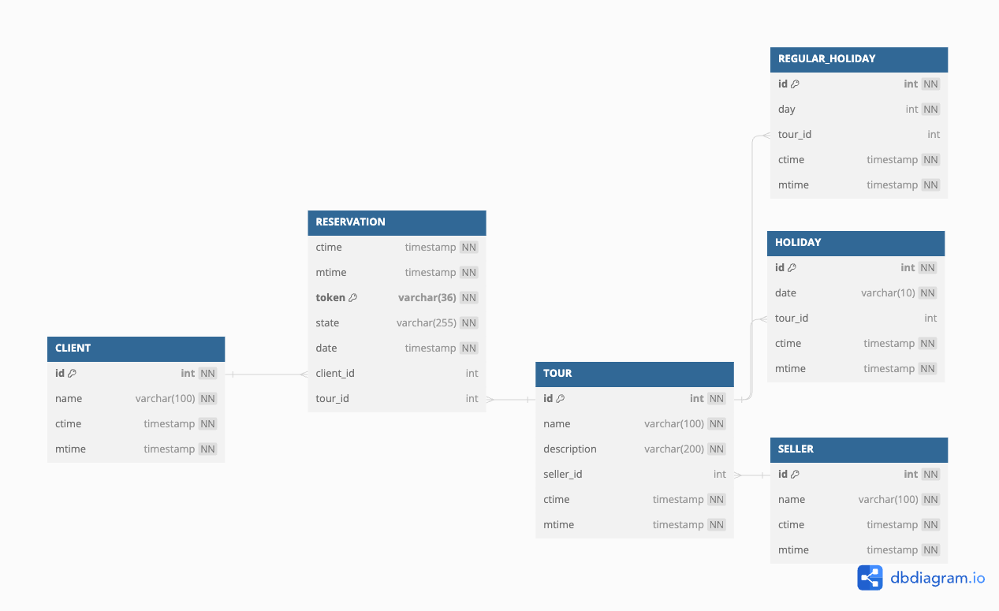
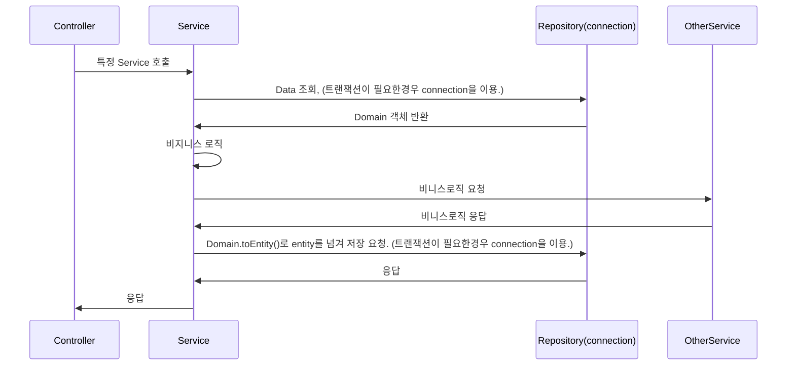

## Description

줌줌투어 과제 repository

## 사용 기술
- NodeJS
- NestJS
- TypeORM
- Redis
- MySQL
- Docker
- Docker-compose
- Swagger

## Installation

```bash
$ npm install
```

## Running the app

- 기본적으로 해당 서버는 `docker-compose`로 실행하는 것을 추천드립니다.
  - `docker-compose`로 실행하는 경우 테스트용 데이터가 삽입됩니다. 만약 `appserver`만 실행 시키는 경우 `./volume/init.sql`을 확인하시면 테스트용 데이터 삽입 쿼리를 확인할 수 있습니다.
  - `docker-compose`로 실행하지 않는 경우 `.env` 파일에서 접속 정보를 변경 부탁드립니다.

```bash
## 실행 Docker 이용 // appServer, redis, mysql 동시에 실행됨.
docker-compose up --force-recreate

## server 단독 실행
## .env 에서 Redis, Mysql 접속 정보를 수정한뒤 실행해야 합니다.
npm run start:dev
```

## Test

```bash
# unit tests
$ npm run test

# test coverage
$ npm run test:cov
```

## API Doc

- 서버 실행 후 다음으로 접속하시면 Swagger Page를 보실 수 있습니다.
- [apidoc link](http://localhost:3001/apidoc)

## DB 설계

- [init.sql](./volume/init.sql)에 테이블 설계 및 테스트용 데이터 삽입 쿼리가 들어가 있습니다.
- [링크](https://dbdiagram.io/d/65943311ac844320ae1c4ca8)에서 아래 데이터를 확인하실 수 있습니다.


- `CLIENT Table`
  - 고객 테이블
  - 고객의 정보가 저장
- `SELLER Table`
  - 판매자 테이블
  - 투어를 판매하는 판매자의 정보가 저장
- `TOUR Table`
  - 투어 테이블
  - 투어 정보가 저장
  - SELLER 테이블과 1:N 관계에 있습니다.
- `HOLIDAY Table`
  - 비정기적 휴일을 저장하는 테이블
  - date의 경우 'YYYY-MM-DD' 형태로 날짜가 저장됩니다.
  - Tour 테이블과 1:N 관계에 있습니다. 
- `REGULAR_HOLIDAY Table`
  - 정기 휴일을 저장하는 테이블
  - day의 경우 0(월), 1(화), 2(수), 3(목), 4(금), 5(토), 6(일)중 하나가 저장됩니다.
  - Tour 테이블과 1:N 관계에 있습니다.
- `RESERVATION Table`
  - 예약 내역을 저장하는 테이블
  - state의 경우 'WAIT', 'APPROVE', 'CANCEL' 중 하나가 들어갑니다.
  - date의 경우 'YYYY-MM-DD 00:00:00'의 형태로 날짜가 저장됩니다.
  - token의 경우 UUID 값으로 유일한 값입니다.

## 캐시 구조
- 현재 일별 데이터를 저장하기 위해서 Redis Hash를 이용하였습니다.
- Key
  - `reservation|${tourId}|${year}-${month}` 형태를 가집니다.
- Value
  - 날짜를 Key로 가지며, value는 예약가능한 숫자를 저장하고 있습니다.
  ``` text
  {
    "1": "0",
    "2": "5",
    "3": "0",
    # ...생략...
    "30": "5",
    "31": "5"
  }
  ```
- 캐새의 경우 다음과 같은 경우 업데이트가 진행됩니다.
  - 고객이 투어의 새로운 예약이 생성되었을 경우
  - 고객이 투어의 기존 예약을 취소했을 경우
  - 고객이 투어의 특정 예약가능한 월을 조회하였는데, 해당 데이터의 캐시가 존재하지 않는 경우
  - 판매자가 투어의 휴일이 변경하였을 경우

## 프로젝트 구조
```text
# 기본 구조
src
├── app.controller.ts
├── app.module.ts
├── app.service.ts
├── infra                     # Infra 관련 모듈
│   ├── database              # Database 관련 파일 폴더
│   │   └── entity            # Entity 파일을 모아놓은 폴더
│   └── redis                 # Redis 관련 모듈
│       ├── redis.module.ts 
│       └── redis.service.ts
├── main.ts
└── module

# module 구조 (Client Module을 예시로)
client
├── client.controller.ts    # Controller 파일
├── client.module.ts        # Module 파일
├── domain                  # Domain 파일을 모아놓은 폴더
├── dto                     # dto 파일을 모아놓은 폴더
├── repository              # 레파지토리 파일을 모아놓은 폴더
└── service                 # 서비스 파일을 모아놓은 폴더
```
- 기본적으로 module 단위로 분리되어 있습니다.
  - module 별로 domain, dto, repository, service 폴더를 가지고 있습니다.

## 코드 구조

- Controller
  - Module별로 Controller가 존재
  - Controller가 없는 Module도 존재합니다.
- Service
  - 기본적으로 Service의 경우 Create, Update, delete를 하는 작업의 경우 개별 Serivce 파일로 분리되어 있으며 파일명으로 하는 일을 명확하게 하려 했습니다.
  - Read의 경우 ${moduleName}.service.ts 형태를 가집니다.
  - Service는 다른 Service를 호출 할 수 있습니다.
- Repository
  - 단순 Query의 경우 Repository에서 이를 선언한뒤 이를 사용하도록 되었습니다.
    - Repository의 경우 기본적으로 Domain객체를 리턴합니다.
  - 다만 트랜잭션이 필요한 경우 Service에서 datasource를 이용해서 작업이 되어 있습니다.
- Domain
  - 모든 객체는 Domain으로부터 생성되며, Domain을 생성할 때 validation 체크를 진행합니다.
  - 데이터를 저장하는 경우 Domain으로 부터 Entity를 생성한뒤 Repository에 넘겨서 이를 저장합니다.
